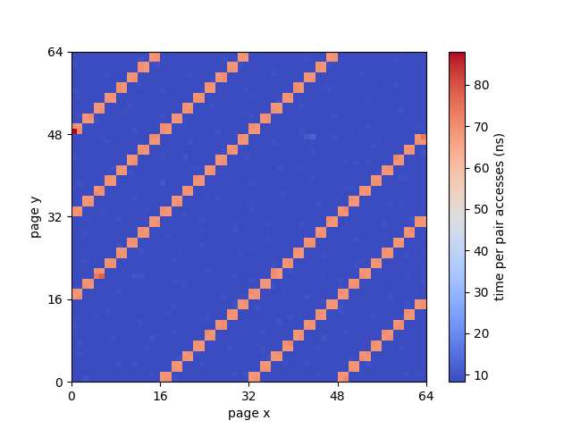
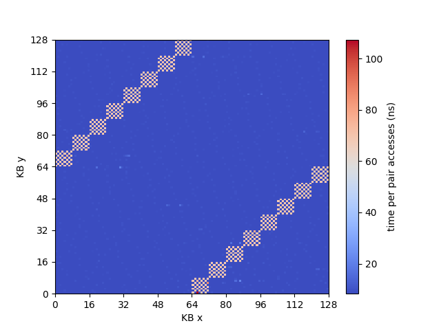
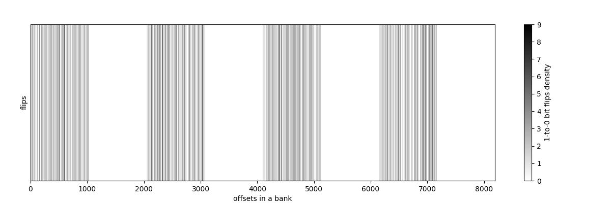
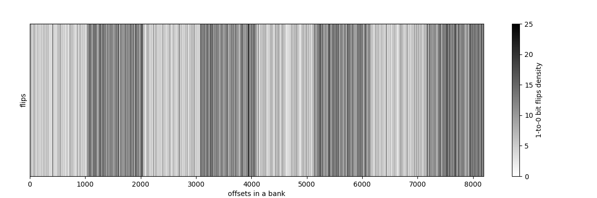
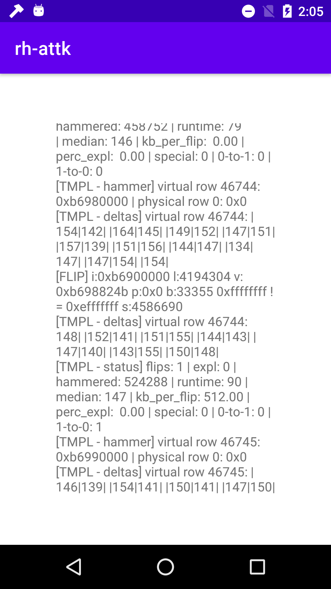

# RowHammer in Smartphones

## Content

- `rh-kernel` is the implementation of experiments from the kernel for memory test.
- `rh-kernel-evict` is the implementation of experiments from the kernel for evict-based RowHammer (in-progress).
- `rh-use` is the implementation of RowHammers from user space. It also contains the row size detector and experiment results.
- `drammer-impl` is the implementation of `drammer` attack from native binary. Partially adapted from [drammer](https://github.com/vusec/drammer).
- `Lowmem` is the Java wrapper implementation for drammer binary to avoid Low Memory Killer. It can compile to an Android app in Android Studio.

## Figures

